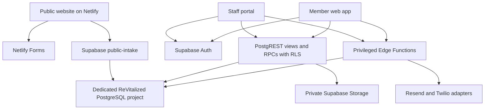

# ReVitalized Academy architecture

2026-10-05 additional beta requirement: secure free Vitality answer save/resume is now required, but **not implemented**. Current architecture remains separate initial/final Netlify Forms plus Supabase progress/Journey metadata. No existing free-user answer restore contract was found. [Audit, proposed constraints and pending identity/private-storage decision](docs/VITALITY_RESUME_BETA_GATE.md). Do not mistake this approved capability requirement for an applied schema, new endpoint or deployed feature.

Beta Readiness Core is now coordinated on existing staging: scoped assignment policies/RPCs and triggers, staff-managementv5 and frontend86a0bf3. Existing models and APIs are retained. A real hosted optional workout-duration defect was repaired by sending NULL for unspecified duration, preserving the database constraint. [Release evidence and remaining configuration/acceptance blockers](docs/BETA_HOSTED_ACCEPTANCE_2026-10-04.md).

Beta Readiness Core v1 (2026-10-04), **local candidate / release held**: [package contract](docs/BETA_READINESS_CORE_V1.md). Existing reusable library content → meal template/workout composition → client assignment → own member detail. New frontend modules use `meal_plan_template_items`, `workout_template_exercises`, `fitness_program_workouts` and existing assignment RPCs; no parallel tables/services. Two own-assignment invoker RPCs expose safe member instructions. Existing calculator remains authoritative. Staff-management handler extraction enables isolated Edge request tests. Staff account/permission transitions restart a cleared document, while individual content/client reads use request generations. The forward migration and Edge/frontend form one undeployed package; hosted acceptance is required.

Member Health & Progress v1 (2026-10-04): [contract inventory and module ownership](docs/MEMBER_HEALTH_PROGRESS_V1.md). The base Health workspace composes existing self-scoped contracts without replacing bootstrap v2 or adding database objects. A shared-client lazy module owns the premium overview, reads optional sections independently, honors configured visibility/source order and existing vNext flags, and handshakes safely if it loads after core bootstrap. Core preflight/results and optional section callbacks use context generations. No accepted staff Nutrition architecture changed.

Nutrition Targets + Trends frontend repair (2026-10-04): the three unchanged secure read RPCs run concurrently as one context-owned UI snapshot. Rendering waits for all three valid responses; any failure clears the entire private view. Context includes generation, contact, date, range and panel/permission state. Target set/clear callbacks capture the rendered context and cannot reload another review. Successful mutations reload the complete snapshot. Date-only labels are local to this module; target rendering has no numeric cap. No database, RPC signature, provider or unrelated architecture changed. See [validation history and repair](docs/NUTRITION_TARGETS_TRENDS_VALIDATION.md). The following held-candidate note is historical.

Nutrition Targets + Trends validation (2026-10-04): [candidate architecture and held-release findings](docs/NUTRITION_TARGETS_TRENDS_VALIDATION.md). The already-applied staging SQL resolves methodology defaults through the active client meal plan's template, gives coach overrides precedence, and provides permission/scope-checked target set/clear and actual-day trend RPCs. Database tests pass. The new frontend loaders are not fully wired and do not preserve the existing private-DOM/request ownership guarantees for targets/trends; do not treat this candidate as deployed functionality. The previous day-review release remains live.

Coach Nutrition Review update (2026-10-04): the [read-only drawer module](docs/COACH_NUTRITION_REVIEW.md) is now implemented as an independent private-health section using the existing scoped admin RPC. It does not depend on Wellness-plan membership or management controls. Request generation/contact/date checks isolate asynchronous renders; no backend contract changed. This supersedes the earlier drawer-UI deferral below.

Current staging addition (2026-10-04): [Nutrition Diary contract](docs/NUTRITION_DIARY.md) adds a shared-client member module and six checked RPCs over existing diary, catalog and target tables. It preserves bootstrap v2 and Nutrition entitlement visibility. Full numeric snapshots, local-calendar trends and coach/program target precedence are implemented; the coach drawer UI remains a separate next package. Earlier sections retain their original dated scope.

Status: observed production architecture plus IMPLEMENTED, undeployed engineering changes, 2026-09-26. This document does not authorize a redesign.

## Product target

One connected member experience spanning coaching, education, nutrition, recipes, workouts, progress, community, family, notifications, ReFuel, referrals and Ask ReVitalized. The four Longevity Matrix pillars are Energized, Athletic, Refined and Organized. Technology supports the coach/member relationship.

The blueprint's Dashboard, Progress, Family Hub and Coach Dashboard images were visually inspected. Preserve daily actions, health/progress charts, energy/sleep/mood/body measurements, achievements, photos, goals, household profiles, shared goals/calendar/challenges and coach operations. Sample scores, percentages, names and health targets in artwork are illustrative, not measured results or approved scoring formulas. [Sources](docs/baseline/SOURCES.md).

## Observed system

- Plain static HTML/CSS/JavaScript; no package manifest or application bundler in the inspected `main` tree. `netlify.toml` publishes `.`. The `site-build/` directory is an older partial copy, not the configured publish root.
- Staff application: `portal/index.html` and `portal/portal-*.js`; member application: `member/index.html`, `member/member110.js`; member activation under `member/activate/`; tokenized journey and video routes under `journey/` and `v/`.
- Frontend and inspected Edge Functions use Supabase JS 2.57.4. Browser configuration contains a publishable key; privileged keys are read inside Edge Functions from environment variables.
- All three compared repositories have `main` as default; only the application repository has the present Supabase wiring and operational portals. No evidence supports replacing this with the older presentation repositories or a fresh ABP/.NET platform.

## Environments and deployment boundary

| Environment | Verified evidence | Limit |
|---|---|---|
| `https://revitalizedacademy.com` | Public GETs return 200 with Netlify headers; member HTML and four sampled JS files match pinned source | Exact Netlify site ID, deploy SHA, branch binding and account settings not exposed here |
| `https://revitalizedacademy.netlify.app` | Same inspected public responses as the custom domain | An alias of the observed site, not an established staging environment. Inspected Edge Function origin allowlists omit this host |
| Supabase `voalfpxiyznnqfcqcymd` | Frontend URLs and active project metadata agree; dedicated ReVitalized project, PostgreSQL 17, us-east-1 | Treat as live. No development branches were returned; no separate staging project verified |
| Other presentation hosting | READMEs describe static deployment; no application integration references | Actual deployed URLs/site bindings remain unverified |

Public HTML differences observed were internal URL rewriting and removal of Netlify form declaration attributes. Those transformations are consistent with hosting post-processing; byte differences alone are not proof of source drift. Public GitHub deployment records and commit statuses do not identify the Netlify deploy SHA.

## Core data domains

| Domain | Observed objects / consumers |
|---|---|
| Identity and permissions | Auth users, profiles, contacts, staff_access, role defaults, explicit overrides, contact scope, client_access |
| Acquisition and journeys | workflow_records/answers, question_mappings, canonical_facts, webinar_events/registrations, contact_journeys/steps/events, automation jobs/tasks |
| Membership and household | program_catalog, client_memberships, entitlements, households, household_members, family_change_requests |
| Coaching and daily activity | coach assignments, sessions, assignments, check-ins, goals, habits, progress entries |
| Wellness and learning | nutrition/fitness methodology and assignment tables, meal plans, recipes, courses/modules/lessons/resources, challenges |
| Commercial and agreements | activations, billing plans/subscriptions/invoices/payment records, versioned client/staff agreements and acceptance records |
| Communication/community | conversations/messages/attachments, notification preferences and outboxes, personal video, community membership/posts/moderation |
| Progress and health | metric catalogs, health providers/connections/consents/observations, sync batches, wellness-score snapshots, progress photos, achievements |
| AI | approved knowledge sources/chunks, ingestion/revisions, retrieval requests, source provenance, coach review, feedback, usage/context/personalization |
| Mobile and privacy | device registry, runtime configuration, deep-link routes, push jobs, mutation receipts, sync events, privacy requests/actions/exports |

The model uses a dedicated Supabase project and contact/household membership boundaries. A tested cross-organization tenancy model for Global Propel is not established by this baseline. “GLOBAL/HYBRID/REVITALIZED” in historical planning describes intended reuse, not implemented shared tenancy.

## Protected acquisition paths

1. **Assessment-first:** contact capture → approved assessment → Longevity Matrix video/thank-you → reviewed report → coach outreach → consultation → enrollment → onboarding.
2. **Enrollment-first:** initial contact/application → assessment when needed → interview → agreed program/payment → health onboarding. The approved self-guided membership target includes upfront payment and access after payment plus assessment, with the documented agreement/readiness checks also preserved. Precedence should be confirmed before changing activation rules.
3. **Webinar:** currently priority pre-registration for 50 seats; $50 reservation intent recorded, payment acceptance not verified. Do not interpret the old roadmap's 30–40 seats as permission to change the current approved 50.

Assessment contact and full response submission use separate Netlify forms. `js/revitalized-data.js` mirrors contact/progress/completion into Supabase and derives a limited set of concern/goal tags. It does **not** transfer the full adult/child answer bank. Its comment saying it does not read health answers is too broad: the code reads selected values/free text to derive tags. The detailed onboarding health profile uses its own bridge. Do not assume `workflow_answers` means all public assessment answers already live in Supabase.

## Bootstrap and backend drift

`my_app_bootstrap_v2` is the live member frontend contract. Database views through `my_app_bootstrap_v27` add health cards, progress photos, wellness/family scores, achievements, coaching momentum, AI governance, calendar, next actions, device/runtime/sync, privacy, enrollment readiness and signatures. Some health datasets are fetched separately in Build 192. The later view's existence does not establish complete UI integration.

The migration ledger ends at 185 entries on `20260926051441`; a read-only search of stored statements found no v20–v27 view references. Later objects exist, but their deployment path is not documented. No SQL migration files, Supabase config or Edge Function source are tracked in the inspected application tree. Recover source and reconcile provenance before adding migrations; never recreate live objects simply because files are missing.

## Integration maturity

- **Health:** backend consent/normalization/sync foundation, including `sync_my_mobile_health_batch`, exists. Apple Health and Health Connect require native client implementation; no native project was found. Provider registry entries for Oura/Fitbit/Garmin/Withings are not proof of OAuth connections.
- **AI:** embedding/retrieval and human escalation exist. The inspected request service stops at retrieval/draft readiness and declares no generation provider. Approved content/ingestion and isolated end-to-end validation remain prerequisites.
- **Email/SMS:** Resend and Twilio code exists; SMS configuration is disabled/setup required. Branded password reset targets `/portal/password-reset.html`. Provider success is unverified.
- **Push/offline:** backend tables/RPCs and settings exist; native client retry/sync and a working APNs/FCM delivery path were not demonstrated.
- **Payments/ReFuel:** provider-neutral records and readiness foundations exist. Merchant integration, checkout, callbacks, refunds and commerce fulfillment were not verified.

## Implemented engineering package (not deployed)

The application now tracks recovered backend definitions and original Edge deployments under `supabase/baselines/2026-09-26`, editable functions under `supabase/functions`, and one normal forward migration. [Recovery boundaries and workflow](supabase/SOURCE_RECOVERY.md) distinguish observed live structure from the test platform and proposed release. Earlier statements about missing repository source describe the pre-package baseline.

Privileged companion and journey operations ask a JWT-scoped permission RPC before using their administrative data client. An atomic export API selects the permitted ordinary fields and records its audit in one transaction. Signing now uses narrow private database helpers invoked by public invoker RPCs: caller identity, ownership, content hash, acceptances, aggregate agreement state and onboarding changes are handled transactionally. A shared readiness predicate checks payment totals/waivers and required agreements/signatures. Link-based member account creation rechecks it. Existing active records are not mass-modified.

Database changes precede compatible Edge/frontend releases. Member bootstrap remains v2, with additive signing hashes in the existing agreement views. [Compatibility plan](docs/BOOTSTRAP_COMPATIBILITY.md) specifies consumed fields, privacy/auth checks, performance measurement and gradual upgrades.

APPROVED: ReVitalized owns the system of record; GoodBarber can be a shell; Mighty Networks does not own core data; unfinished Global Propel work is not a runtime dependency. Adult health is private by default and guardian/minor access is relationship-aware. Score methodology requires Justyn/Elle approval. Payment and required agreements are independent gates, each complete or explicitly waived. The assessment's Netlify flow remains in place.

## Approved client lifecycle extension (implemented, not deployed)

The user approved restricted authenticated onboarding, independently authenticated secondary adults and payment suspension/restoration. The existing membership/access/activation/ledger/agreement system remains authoritative. `client_access` adds `onboarding` and `payment_suspended`; membership and enrollment statuses map to the same state machine. Payment totals and per-agreement distinct-account signatures remain independent gates.

`/member/onboarding/` consumes a narrow authenticated RPC; the paid dashboard checks access before the existing v2 bootstrap. The secondary signer relationship is a private, expiring agreement invitation, not household/member access. Invitation delivery extends the existing outbox to support not-yet-registered recipients; no parallel notification service exists. Financial reconciliation updates current access without deleting historical data. [Full state machine and rollout contract](docs/CLIENT_ACCESS_LIFECYCLE.md). Statements above about unimplemented lifecycle behavior describe the earlier security branch.

## Isolated staging configuration (implemented, not hosted)

The lifecycle branch is extended by codex/staging. Browser environment resolution is in js/environment.js; production public mapping lives in config/production.json; build-time staging values are explicit. Every active frontend caller uses the resolved environment. Edge runtime isolation/CORS/callback and synthetic-recipient checks live in supabase/functions/_shared/environment.ts. Public/member/onboarding/Auth/notification origins derive from one explicit environment origin; v2 stays unchanged.

netlify.toml now builds dist through scripts/build-site.cjs and the exact config/public-files.json manifest. Backend, engineering evidence, private legal inputs and dev tools cannot enter that artifact. The observed live root publish configuration above is historical production evidence, not the new branch configuration.

Fresh staging uses the catalog baseline and two original forward files, followed by safe configuration/legal seeds and staging-only constraints. A private hash receipt tracks actual components without pretending to recover managed schemas or historical migrations. Hosted resources/settings are separate and still need validation. See docs/STAGING_ENVIRONMENT.md and docs/STAGING_RELEASE_RUNBOOK.md.
