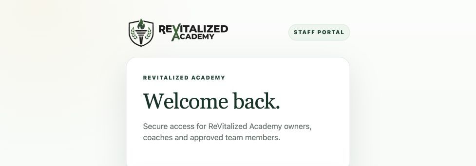

# Beta Readiness Core v1 — held release evidence

This directory describes a **local candidate**, not a deployment. Read [the package report](../../docs/BETA_READINESS_CORE_V1.md). The source commit is in `build-receipt.json`; a later evidence-only commit does not change those built assets. Staging stays at deploy `6ac1fec19f756106b6a84964`.

- `build-receipt.json`: all313 exact local public file SHA-256 hashes, explicit staging site/project and source commit; runtime matched accepted staging byte-for-byte.
- `*-final.log`: complete final validation output. `beta-built-final.log` uses `RVA_BETA_ASSET_ROOT=dist`. Backend uses PostgreSQL17.11 on loopback and creates/drops a uniquely named database. Edge uses the repository lock with frozen dependencies, not permissive remote imports.
- `responsive.json`:33 measurements of11 views at1440×1000,768×1024,390×844; no horizontal page/dialog/control overflow. Browser transport is explicitly synthetic and local, using exact built modules/CSS. Full hosted lifecycle acceptance is **not** proven.
- `member-workout-*.png`: long-text rendering in the actual assigned-detail module, mounted in the labeled fixture.
- `browser-console.json`: successful local and hosted-pending-page console results.
- `hosted-readonly.json`: aggregate staging inventory and Netlify control-plane IDs. No private identities, tokens or credentials recorded.
- `public-before.json` / `production-after.json`:20 production URL status/hash comparisons, all unchanged.
- `hosted-staff-pending.png`: current normal session lacks approved staff access; no grants were manufactured.

Maintained entry points: `npm test`, `npm run check:js`, `npm run test:backend` with `RVA_TEST_PGPORT=55449` and native PostgreSQL17 on PATH; `deno test --frozen --cached-only --allow-env --allow-read --config supabase/functions/deno.json tests/edge/`; corresponding frozen/cached Deno check of the19 Edge index files. Build uses the existing staging configuration with explicit project/site/origin guards and unchanged public runtime; never use production credentials to reproduce it.

The nine historical agreement failures were fixed in disposable fixture setup, not by changing agreements or payment rules. Existing27 frontend skips and the Edge dependency deprecation warning remain disclosed. No hosted business data, migrations, permissions or flags were changed.

