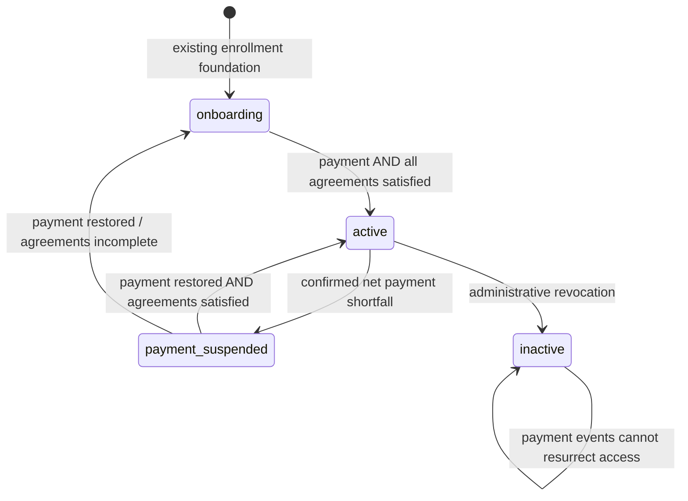

# Client onboarding and access lifecycle

Implemented on `codex/client-access-lifecycle`, based on `018c7441e318b6bde72d8001b796c7d587de7b61`. Tested only in disposable local databases and synthetic browser/HTTP fixtures. No production migration or deployment has occurred.

## Approved decisions

The user's 2026-09-26 lifecycle assignment authorizes limited authenticated onboarding, two independently authenticated adults when required, and payment suspension/restoration. These resolve the three earlier primary Chat questions. Payment and agreement gates remain independent. Public assessment, branding, images, 50-seat priority flow and six-month Foundations terms are protected.

## State machine

| `client_access.status` | Meaning | Member capability |
|---|---|---|
| `onboarding` | Enrollment exists; at least one gate is incomplete | Own enrollment, program/payment summary and link, issued agreements, account email, relevant notices and support |
| `ready`, `invited` | Existing states retained for compatibility | Limited account/signing surfaces; not full paid access |
| `active` | Enrollment and membership active; both gates currently satisfied | Existing member capabilities subject to their original row, relationship, consent and entitlement policies |
| `payment_suspended` | Previously active; net payment below requirement and no payment waiver | Own billing/agreement/account/support surfaces; paid data/API access denied |
| `inactive`, `suspended` | Existing administrative revocation/restriction | Support; no automatic restoration from repayment |
| No client-access row | A verified co-signer may hold an agreement invitation | Invited/previously signed agreement only; no membership, enrollment billing, household or health access |

The existing `client_memberships` row maps to pending / active / paused. `journey_enrollment_activations` maps to pending / ready / active / suspended. No second membership system exists. Pending enrollments now provision their existing foundation early; paid feature access does not follow merely from the presence of that foundation.

Payment satisfaction comes from recorded payments/adjustments minus recorded refunds/reversals, matching the enrollment's contact and currency, or an authorized payment waiver. A status label alone cannot satisfy the gate. Reversed/voided records do not count. Financial writes lock the enrollment before reconciliation. Existing records cannot be moved to another enrollment/contact/currency; reverse and replace them instead.

Every required agreement must be signed with the correct hash and sufficient **distinct user IDs**, including a primary signature, or waived individually. A legacy blanket agreement waiver applies only where no individual agreements exist; new authenticated blanket waiver writes are rejected. Existing historical waivers/acceptances are not deleted or silently rewritten.

## Primary client onboarding

`/member/onboarding/` uses ordinary Supabase Auth sign-in/signup and email verification. The old `/member/activate/?token=...` entry redirects to an enrollment fragment; the page removes that fragment immediately. Tokens are not put in browser storage, analytics or subsequent navigation. After email verification in another tab, the client reopens the original invitation.

`claim_onboarding_enrollment` checks the active/unexpired existing journey token, confirmed Auth email, contact email, profile binding and non-revoked access. New foundations carry `needs_onboarding_claim=true`. Auth-trigger email/profile linkage alone does not expose the enrollment, agreements or paid resources. Claiming the private journey invitation clears that flag for the verified recipient and reevaluates the existing gates. Existing historical access rows retain their mapping; no bulk reclassification runs. It never accepts a caller-supplied user ID. Existing account creation/profile linkage remains in the existing Auth trigger; direct client profile relinking is revoked. The `member-account` Edge endpoint now forwards the authenticated claim and no longer creates users with a privileged password/account call.

The page exposes a narrow allowlist of enrollment fields, issued agreement content and billing/agreement notices. It links to the existing payment URL and existing support email; it does not introduce payment processing or new contract terms. Member dashboard startup checks `member_paid_access_allowed` before its existing bootstrap v2 reads. No v27 switch is included.

## Independent secondary signatures

1. The primary adult or appropriately scoped active financial manager queues an invitation for an issued, rendered two-adult agreement. The recipient must differ from the primary adult. The existing notification delivery outbox is used. Sending requires an explicitly approved HTTPS origin in the existing `app_runtime_config` row `client_onboarding`; the migration supplies an inactive, unset row, never a production fallback. Staging must configure its own origin and matching Auth redirects before delivery testing.
2. The database generates 32 cryptographically random bytes. The private invitation table stores the SHA-256 digest, exact agreement/activation/household IDs, immutable displayed hash, creator and a 72-hour expiry. No household membership or primary contact binding is created.
3. The recipient signs up/signs in as themselves, verifies their email and redeems the link. A known minor is rejected; the signing UI also requires adult/self-signing attestation. This is authenticated e-signature, not external government identity/age verification.
4. Recipient email, expiry, revocation, hash and prior redemption are checked. Same-recipient redemption retries are idempotent; a different user is denied. Signatures use the caller's `auth.uid()`, never a supplied identity.
5. Each request contains exactly one authorized role. The primary and secondary roles cannot share an Auth identity or overwrite each other's slot. Identical valid signature retries return the existing acceptance without changing its timestamp/name/hash.
6. Accepted content/version/parties/signature requirements become immutable. Revised terms require a separately issued agreement. Both acceptances must match the same rendered hash. Invitation revocation stops future signing; it does not erase an already executed agreement or the signer's own historical copy.

The outbox necessarily contains a delivery copy of the invitation URL until delivery/redemption/cancellation. Authenticated clients, including staff, cannot read invitation delivery rows. Only the privileged existing dispatcher can send them; it checks expiry/revocation/redemption and removes the secret from successful or cancelled jobs. The private durable invitation/audit never stores plaintext tokens. Delivery retries use the existing provider idempotency key. Provider delivery itself was not exercised.

## RLS, APIs and auditing

- Restrictive policies add a paid-access requirement to 165 existing public tables and private Storage objects. Original row/permission/relationship policies still apply. This blocks stale community participants, assigned resources and profile-based health/coaching policies from bypassing payment restriction.
- Exceptions are the existing identity/staff/signing/status surfaces. Agreement/template/acceptance exceptions keep their existing ownership policies and additional state checks. Co-signers receive a sanitized agreement response from the private helper rather than access to the primary client's base rows.
- All new public RPCs are security invoker. Necessary definer helpers live in `private` with fixed search paths, caller checks and explicit grants. Trigger-only helpers have no direct client execution. Anonymous protected RPC calls fail.
- The four member coaching/family/companion definer helpers now bind their user argument to the actual caller and require full access. Privileged member coaching/companion Edge operations also call the central paid-access predicate.
- New waivers require an active, permitted, scoped owner/admin, a reason and recorded actor/time. `set_enrollment_waiver` writes the existing manual override audit transactionally. Database triggers also audit waiver transitions, so direct permitted changes cannot omit the contact activity record. The old individual waiver API delegates to this lifecycle for enrollment contracts.
- State changes append to existing contact activity and relevant member notifications. Suspension does not delete accounts, goals, health observations, coaching records or historical acceptances. Repayment cannot restore missing signatures or administrative revocation.
- The existing staff payment recorder preserves the contracted required amount when recording partial payments. A payment receipt is not a plan-price change.

## Verification and release constraints

[Evidence](engineering/LIFECYCLE_TEST_RESULTS.md) covers actual PostgreSQL RLS/constraints/triggers, new API handlers, frontend semantics, synthetic desktop/mobile inspection and local plus live-read-only advisors. The previous two-name/single-account signature success expectation was explicitly replaced by rejection because the approved requirement changed; independent two-account success is tested separately.

Before any release: reconcile genuine migration history and live schema drift, confirm a non-production Supabase/Netlify binding and Auth redirect allowlist, recover approved business/legal seed data, inventory legacy active memberships and same-account historical double signatures, and run real authenticated staging acceptance. Do not automatically grandfather incomplete records or run a bulk state rewrite. Scope/grant exceptions and production-shaped performance need staging review. The local minimal Auth/Storage scaffold is not GoTrue/PostgREST/provider certification.

Deploy in a coordinated, explicitly approved database → Edge → frontend sequence. Old cached signing clients that submit two roles will be rejected and need reloading; old unauthenticated member-account requests receive an authentication error. Verify the notification dispatcher and email confirmation/recovery experience on the approved staging origin. Root-directory Netlify artifact exclusion remains a release check. No production actions are authorized by this package.
